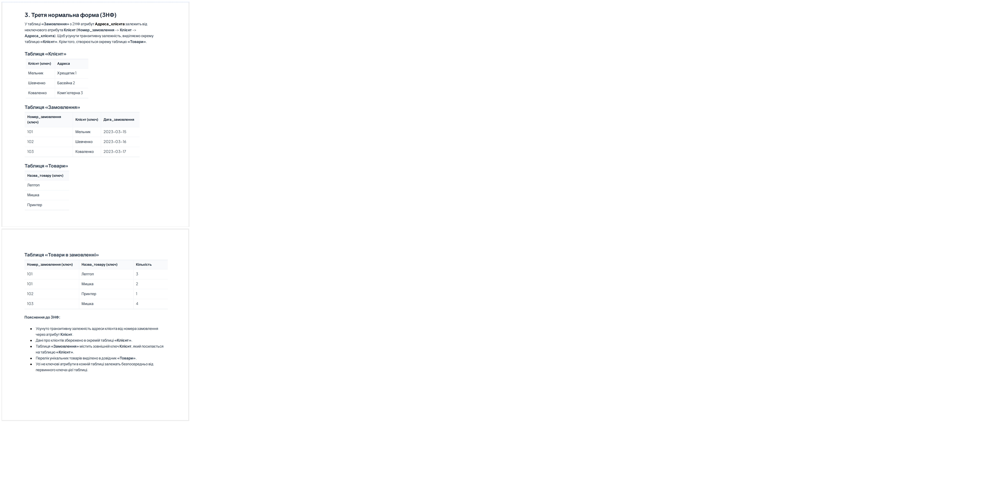
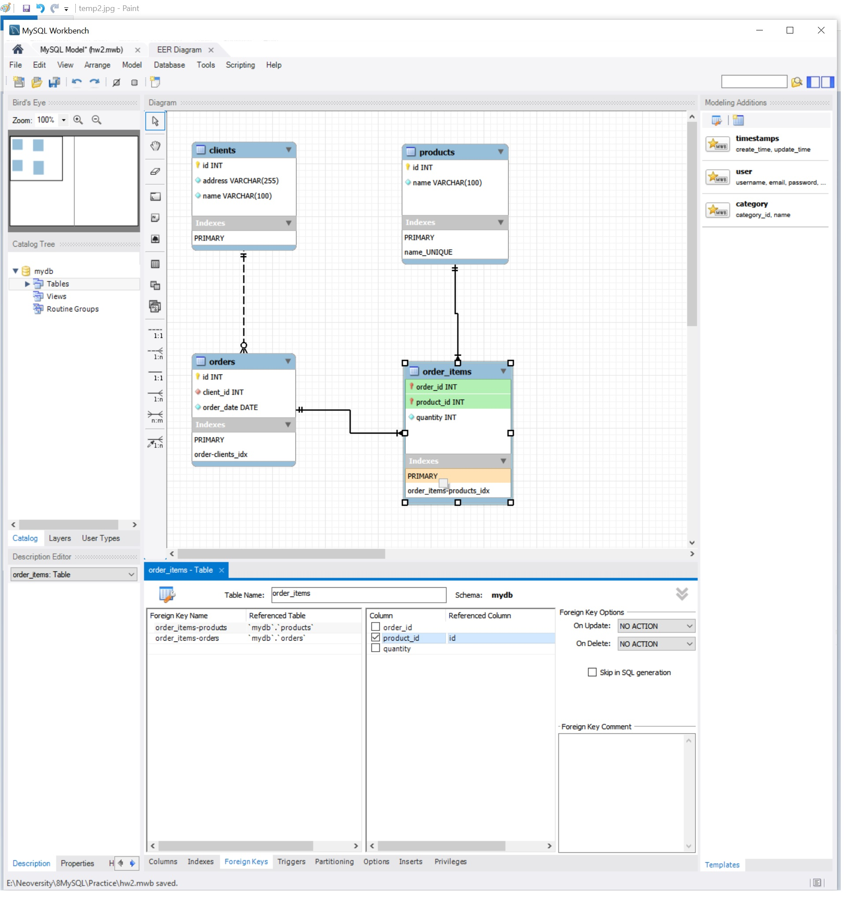
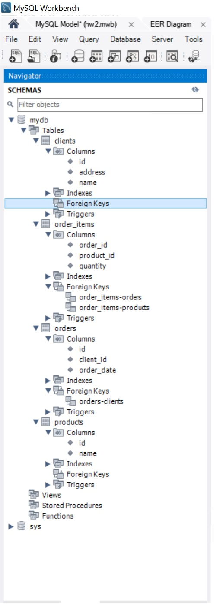

# 🗄️ Нормалізація реляційних баз даних

Цей репозиторій містить практичні завдання щодо приведення заданої таблиці до основних нормальних форм (**1NF**, **2NF**, **3NF**).

---

## 📚 Документація

Нижче наведено посилання на Google Документи з детальним описом кожної нормальної форми:

| Етап | Нормальна форма | Посилання на документ | Опис |
| :---: | :--- | :---: | :--- |
| **1** | **Перша нормальна форма (1НФ)** | [Відкрити Google Doc ↗](https://docs.google.com/document/d/1R9GmPyCYfZpoAJJmdlqo7esRxxNh2K6c41q40yzQ5Wo/edit?usp=sharing) | Атомарність атрибутів, усунення повторюваних груп та масивів значень. |
| **2** | **Друга нормальна форма (2НФ)** | [Відкрити Google Doc ↗](https://docs.google.com/document/d/17_3QrUeR-8XTfQ0iUuRbF-EC3T2Dch9denMYGoB5Tao/edit?usp=sharing) | Відповідність 1НФ та відсутність часткових функціональних залежностей від складеного ключа. |
| **3** | **Третя нормальна форма (3НФ)** | [Відкрити Google Doc ↗](https://docs.google.com/document/d/1Vvm05s8SXgOjcBilAoB5BPxSTxED03SA5Te2JlgEaPE/edit?usp=sharing) | Відповідність 2НФ та усунення транзитивних залежностей між неключовими атрибутами. |

---

## 📌 Короткий огляд правил

- **1НФ:** Кожне поле містить лише одне неподільне значення; кожен запис є унікальним (наявність первинного ключа).
- **2НФ:** Усі неключові атрибути залежать від **усього** первинного ключа повністю, а не від його частини (актуально для складених ключів).
- **3НФ:** Жоден неключовий атрибут не повинен залежати від іншого неключового атрибута ($X \to Y \to Z$).

---

## 🖼️ Ілюстрації етапів нормалізації

Нижче представлені графічні матеріали та схеми переходу між нормальними формами:

| Етап | Зображення | Документ (PDF) |
| :--- | :---: | :---: |
| **Приведення до 1НФ** | [Переглянути схему (1NF.jpg)](./1NF.jpg) | [Завантажити 1NF.pdf 📄](./1NF.pdf) |
| **Приведення до 2НФ** | [Переглянути схему (2NF.jpg)](./2NF.jpg) | [Завантажити 2NF.pdf 📄](./2NF.pdf) |
| **Приведення до 3НФ** | [Переглянути схему (3NF.jpg)](./3NF.jpg) | [Завантажити 3NF.pdf 📄](./3NF.pdf) |

> *Попередній перегляд ілюстрацій:*
>
> 

>   
<b>Розгорнути схеми 1НФ, 2НФ та 3НФ</b>

>
>   ### 1НФ
>   
>
>   ### 2НФ
>   
>
>   ### 3НФ
>   
> 

---

## 📐 ER-модель (Діаграма «сутність-зв'язок»)

Фізична модель реляційної бази даних, побудована в **MySQL Workbench** з урахуванням декомпозиції зв'язків та кардинальностей ($1:N$, $N:M$ через сполучну таблицю):

- 📄 **Файл моделі Workbench:** [`hw2.mwb`](./hw2.mwb)
- 🖼️ **Схема діаграми:**

---

## 🗃️ Реалізація в базі даних

Скріншот створених таблиць, первинних та зовнішніх ключів у СУБД:

